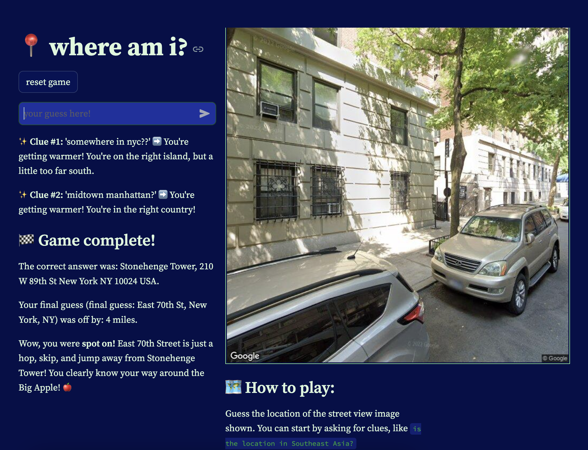

# whereami
📍 AI-based geo guesser game 🗺️



### how to run 

#### frontend (`localhost:8501`)

```
cd src/frontend 
streamlit run streamlit.py
```

#### backend (`localhost:8000`)

```
cd src/backend
fastapi dev main.py
```


### built with: 
- [Python - FastAPI](https://fastapi.tiangolo.com/tutoria)
- [Python - Streamlit](https://docs.streamlit.io/)
- [Gemini Developer API (Gemini Flash, Python SDK)](https://ai.google.dev/gemini-api/docs/get-started/tutorial?lang=python)
- [Google Maps API](https://developers.google.com/maps/documentation) 
- [Geopy](https://geopy.readthedocs.io/en/stable/)
